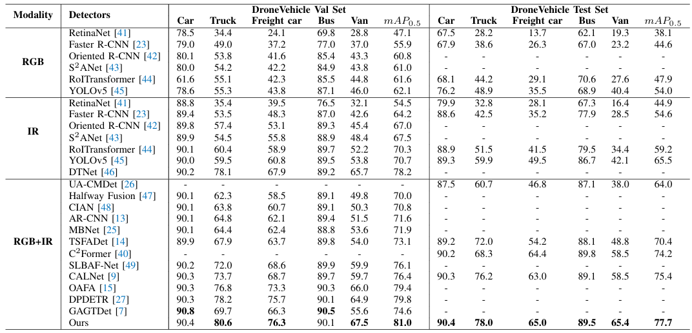
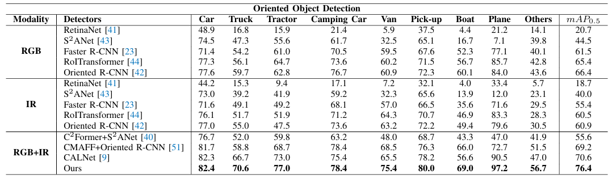
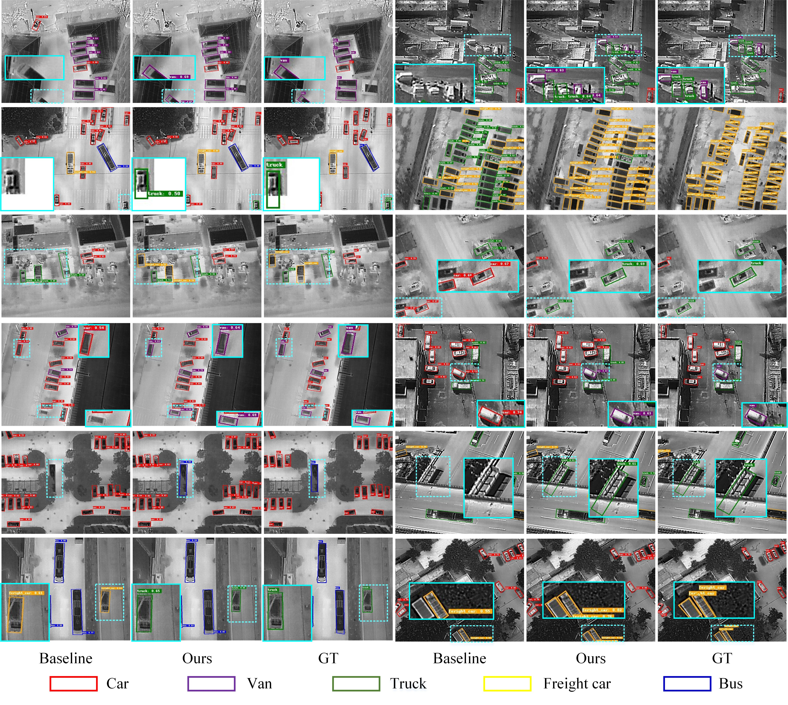
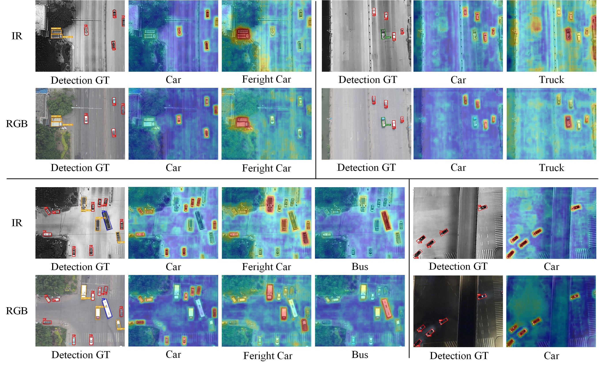

# LPANet

<h3 align="center">
Large Language Model Guided Progressive Feature Alignment for Multimodal UAV Object Detection
</h3>

<p align="center">
Wentao Wu, Chenglong Li*, Xiao Wang, Bin Luo
</p>

<p align="center">
<a href="https://arxiv.org/pdf/2503.06948">📄 arXiv</a> |
<a href="https://ieeexplore.ieee.org/abstract/document/11568942">IEEE TIP</a>
</p>

## News

- **[02-Jun-2026]** 🎉 LPANet has been accepted by **IEEE Transactions on Image Processing (TIP)**.

---

# Abstract

Existing multimodal UAV object detection methods often overlook the semantic gap between modalities, making it difficult to achieve accurate semantic and spatial alignments.

To address this problem, we propose **Large Language Model Guided Progressive Feature Alignment Network (LPANet)**, which leverages semantic knowledge extracted from large language models to guide progressive semantic and spatial alignment between modalities.

Specifically, we first generate fine-grained category descriptions using ChatGPT and extract semantic representations using MPNet, providing high-level semantic priors for multimodal feature alignment.

Based on these semantic priors, LPANet introduces three progressive alignment modules:

- **Semantic Alignment Module (SAM)**
- **Explicit Spatial Alignment Module (ESM)**
- **Implicit Spatial Alignment Module (ISM)**

Extensive experiments on DroneVehicle and VEDAI demonstrate that LPANet achieves superior performance compared with existing multimodal UAV object detection approaches.

<p align="center">

</p>

---

# Installation

Install dependencies:

```bash
pip install -r requirements.txt
```

Compile rotated NMS:

```bash
cd utils/nms_rotated
python setup.py build_ext --inplace
cd ../..
```

---

# Dataset Preparation

## DroneVehicle Dataset

The expected structure:

```
DroneVehicle
├── rgb
│   ├── train
│   ├── val
│   └── test
└── ir
    ├── train
    ├── val
    └── test
```

Modify:

```
data/DroneVehicle_poly.yaml
```

and set:

```yaml
path: /path/to/DroneVehicle
```

---

# Semantic Embedding Preparation

The released semantic embedding file:

```
weights/class_description_embedding_mpnet.pkl
```

can be directly used.

---

# Training

LPANet adopts a two-stage training strategy.

## Stage 1

```bash
CUDA_VISIBLE_DEVICES=0 python train.py \
--stage 1 \
--weights weights/yolov5l.pt \
--data data/DroneVehicle_poly.yaml \
--semantic-embeddings weights/class_description_embedding_mpnet.pkl \
--epochs 50 \
--batch-size 4 \
--img 640
```

## Stage 2

```bash
CUDA_VISIBLE_DEVICES=0 python train.py \
--stage 2 \
--weights runs/train/stage1/weights/best.pt \
--data data/DroneVehicle_poly.yaml \
--semantic-embeddings weights/class_description_embedding_mpnet.pkl \
--epochs 50 \
--batch-size 4 \
--img 640
```

---

# Evaluation

Validation:

```bash
python valtest.py \
--data data/DroneVehicle_poly.yaml \
--weights runs/train/exp/weights/best.pt \
--task val \
--semantic-embeddings weights/class_description_embedding_mpnet.pkl \
--save-json
```

Testing:

```bash
python valtest.py \
--data data/DroneVehicle_poly.yaml \
--weights runs/train/exp/weights/best.pt \
--task test \
--semantic-embeddings weights/class_description_embedding_mpnet.pkl \
--save-json
```

---

# Released Model and Results

The pretrained model weights and test results are available at:

https://pan.baidu.com/s/1IJ3_-cgXo3Esvyge4OWHJA?pwd=drn5

---

# Experimental Results

## DroneVehicle



## VEDAI



---

# Visualization





---

# Acknowledgement

We sincerely thank the following open-source project for providing valuable code and resources:

- [CALNet](https://github.com/hexiao0275/CALNet-Dronevehicle)

---

# Citation

```bibtex
@article{wu2026large,
  title={Large language model guided progressive feature alignment for multimodal UAV object detection},
  author={Wu, Wentao and Li, Chenglong and Wang, Xiao and Luo, Bin},
  journal={IEEE Transactions on Image Processing},
  year={2026}
}
```
